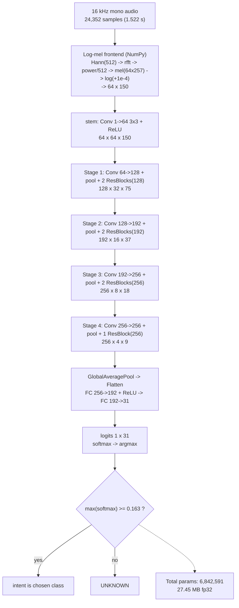

# Command Classifier — Model Architecture

Model: `models/command_classifier/command_classifier.onnx`
Task: 31-class spoken-command ("keyword intent") classification + `UNKNOWN` rejection.

Extracted directly from the ONNX graph (not reconstructed by hand):

| Property | Value |
|---|---|
| **Total parameters** | **6,842,591** (≈ **6.84 M**); weights 6,838,660 + biases 3,935 |
| Model file size | 27.45 MB (float32) |
| Graph input | `logmel` — `float32 [1, 1, 64, 150]` |
| Graph output | `logits` — `float32 [1, 31]` |
| ONNX opset / IR | 18 / 10 |
| Producer | PyTorch 2.14.0 (exported) |
| Nodes / initializers | 54 / 44 |
| Compute | CPU-only ONNX Runtime (`CPUExecutionProvider`), 2 intra-op threads |
| Classifier | ResNet-style 2-D CNN over the log-mel image |
| Decision rule | `softmax(logits)` → argmax; if max < **0.163** → `UNKNOWN` |

---

## End-to-end pipeline

```
  microphone, 16 kHz mono
        │   24,352 samples  (1.522 s window)
        ▼
 ┌───────────────────────────────────────────────────────────────┐
 │  LOG-MEL FRONTEND   (NumPy, features.MetadataFrontend — NOT    │
 │                      part of the ONNX graph)                   │
 │                                                                │
 │  1) frame the signal:  n_fft = 512, hop = 160  → 150 frames    │
 │  2) multiply each frame by a Hann window (512)                 │
 │  3) rfft each frame                    → 257 frequency bins    │
 │  4) power = (re² + im²) / n_fft                                │
 │  5) mel  = mel_filterbank (64 × 257) @ power                   │
 │  6) log(mel + 1e-4)                                            │
 └───────────────────────────────────────────────────────────────┘
        │   log-mel image  (1, 1, 64, 150)     [64 mels × 150 frames]
        ▼
 ╔═══════════════════════════════════════════════════════════════╗
 ║  ONNX CNN   command_classifier.onnx                           ║
 ║  (ResNet-style: see next section)                             ║
 ╚═══════════════════════════════════════════════════════════════╝
        │   logits (1, 31)
        ▼
   softmax  ─►  argmax  ─►  31 intents
                │
                └─ if max(softmax) < 0.163  →  "UNKNOWN"
```

**Frontend parameters** (`command_metadata.json`): `sr=16000`, `n_fft=512`,
`hop=160`, `n_mels=64`, `max_frames=150`, `log_eps=1e-4`, plus the 512-point
Hann window and the 64×257 mel filterbank shipped inline (bit-compatible with
training).

---

## CNN layer structure

```
 input  logmel [1, 1, 64, 150]
   │
   ├── stem:  Conv 1→64, 3×3, s1, p1 + ReLU                     640 params
   │                                          → [1,  64, 64, 150]
   │
   ├── Stage 1
   │     Conv 64→128, 3×3, s1, p1 + ReLU      → [1, 128, 64, 150]
   │     AvgPool 2×2, stride 2                → [1, 128, 32,  75]
   │     Residual block ×2  (128→128)         → [1, 128, 32,  75]   664,192
   │
   ├── Stage 2
   │     Conv 128→192, 3×3, s1, p1 + ReLU     → [1, 192, 32,  75]
   │     AvgPool 2×2, stride 2                → [1, 192, 16,  37]
   │     Residual block ×2  (192→192)         → [1, 192, 16,  37]  1,549,248
   │
   ├── Stage 3
   │     Conv 192→256, 3×3, s1, p1 + ReLU     → [1, 256, 16,  37]
   │     AvgPool 2×2, stride 2                → [1, 256,  8,  18]
   │     Residual block ×2  (256→256)         → [1, 256,  8,  18]  2,802,944
   │
   ├── Stage 4
   │     Conv 256→256, 3×3, s1, p1 + ReLU     → [1, 256,  8,  18]
   │     AvgPool 2×2, stride 2                → [1, 256,  4,   9]
   │     Residual block ×1  (256→256)         → [1, 256,  4,   9]  1,770,240
   │
   ├── Head
   │     GlobalAveragePool (ReduceMean over H,W) → [1, 256, 1, 1]
   │     Flatten / Reshape                       → [1, 256]
   │     FC 256→192 + ReLU                       → [1, 192]          55,327
   │     FC 192→31                               → [1, 31]  = logits
   ▼
 logits [1, 31]
```

Each **Residual block** = `Conv k×k → ReLU → Conv k×k → Add(input, out) → ReLU`
(a standard "basic block" with an identity skip connection).

Notes on the graph:
- **2-D convolutions**: the two spatial axes are **(mel-frequency, time)**.
- Every `Conv` uses `kernel 3×3, stride 1, pad 1` (same padding); channels grow
  `1 → 64 → 128 → 192 → 256`.
- Downsampling is done by `AveragePool 2×2 stride 2` after the first conv of each
  stage (spatial size `64×150 → 32×75 → 16×37 → 8×18 → 4×9`).
- Skip connections are plain identity `Add`s (shapes match within a stage).
- **No BatchNorm** appears in the exported graph (folded into the conv weights at
  export, if present at all).

---

## Parameter budget

| Stage | Input → Output | Params | Share |
|---|---|---:|---:|
| stem | (1, 64, 150) → (64, 64, 150) | 640 | 0.01% |
| Stage 1 (128 ch) | (64, 64, 150) → (128, 32, 75) | 664,192 | 9.7% |
| Stage 2 (192 ch) | (128, 32, 75) → (192, 16, 37) | 1,549,248 | 22.6% |
| Stage 3 (256 ch) | (192, 16, 37) → (256, 8, 18) | 2,802,944 | 41.0% |
| Stage 4 (256 ch) | (256, 8, 18) → (256, 4, 9) | 1,770,240 | 25.9% |
| head | (256) → (31) | 55,327 | 0.8% |
| **Total** | | **6,842,591** | 100% |

> Most of the capacity sits in the high-channel stages (3–4). At 27 MB float32
> it is fine for a Raspberry Pi 5; int8 quantisation would shrink it ~4×.

---

## Other important information

- **Latency / runtime**: measured by `rpi_validation/` (end-to-end `predict()`
  and real-time factor); see `rpi_validation/results/latency.json`.
- **Operating point**: `unknown_threshold = 0.163`. The threshold sweep in the
  validation notebook shows the coverage ↔ false-accept trade-off; raising it
  curbs over-confident false accepts at the cost of a higher reject rate.
- **Known behaviour**: on the bundled holdout the model over-predicts
  `COLOR_BLUE` (index **7**), which dominates the confusion matrix.

### Class index map (`class_to_idx`)
```
0  ALARM_6_00AM           8  COLOR_GREEN                   16 MESSAGE             24 TIME
1  ALARM_8_00AM           9  COLOR_RED                     17 NEXT                25 TIMER_10s
2  ALARM_9_00PM          10  CREATE_REMINDER_DRINK_WATER   18 PAUSE               26 TIMER_1m
3  BRIGHTNESS_100        11  CREATE_REMINDER_EXERCISE      19 PLAY_MUSIC          27 TIMER_30s
4  BRIGHTNESS_20         12  CREATE_REMINDER_STUDY         20 STOP                28 VOLUME_DOWN
5  BRIGHTNESS_60         13  LIGHT_OFF                     21 TEMPERATURE_18      29 VOLUME_UP
6  CALL                  14  LIGHT_ON                      22 TEMPERATURE_22      30 WEATHER
7  COLOR_BLUE            15  LIST_REMINDERS                23 TEMPERATURE_26
```

---

## Mermaid diagram



> A rendered image is also produced: `model_architecture.png` (via
> `make_arch_diagram.py`).

